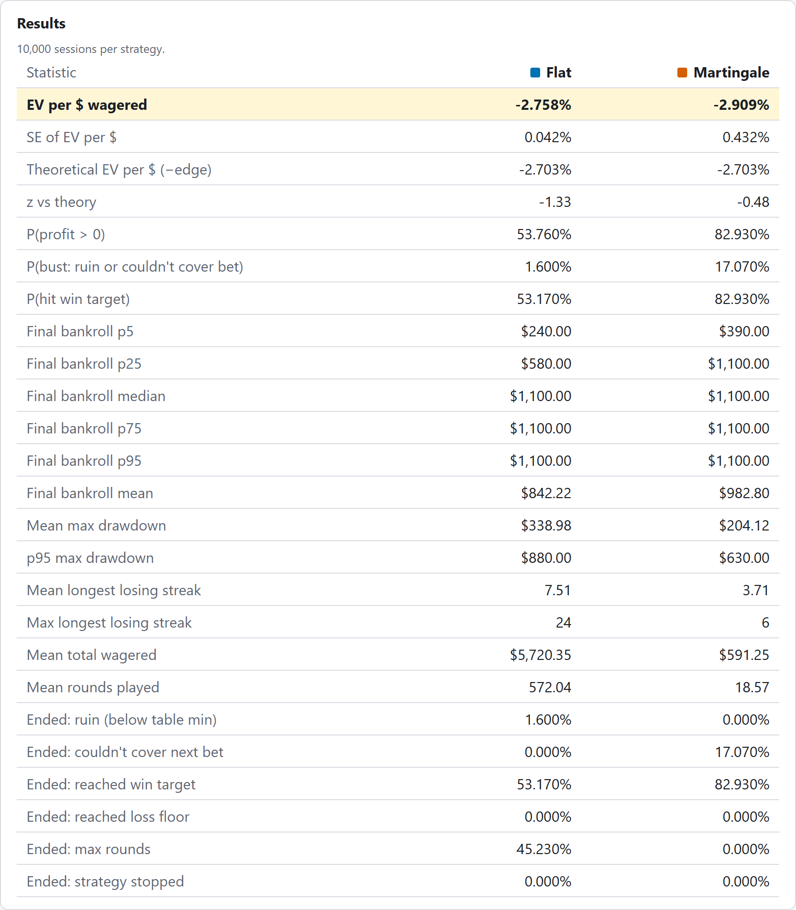
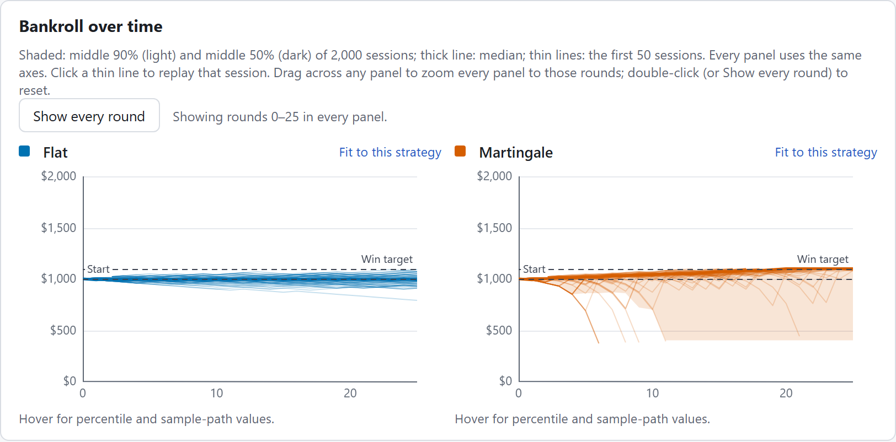
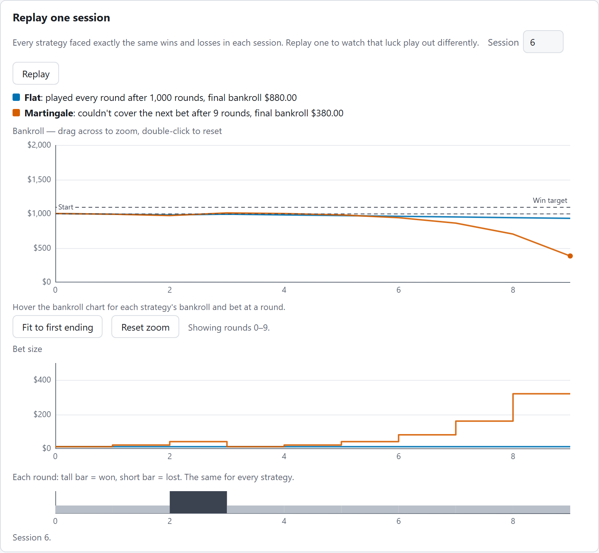

# StrategyLab

**A Monte Carlo simulator for betting strategies.** Run Martingale, Fibonacci, Kelly and others side by side on identical random outcomes, and see how each one reshapes risk without changing the expected loss per dollar wagered.

[](https://github.com/iangopen/strategylab/actions/workflows/ci.yml)
&nbsp;**[Live demo: iangopen.github.io/strategylab](https://iangopen.github.io/strategylab/)**



In any game with a house edge, every bet loses `edge × stake` on average, whatever came before it. So no betting strategy can change the expected loss per dollar wagered. It can only reshape the distribution of outcomes. The table above is the app's default run: European roulette (edge 1/37 = 2.703%), a $1,000 bankroll, $10 base bet, stop at $1,100, 10,000 sessions, seed 12345. Martingale ends in profit in **82.930%** of sessions against Flat's **53.760%**. Yet both lose the same share of every dollar wagered: **−2.909%** and **−2.758%**, against a theoretical **−2.703%**, within sampling error (the z row). Martingale's many small wins are paid for by rare large losses: it busts in 17.070% of sessions. The simulator is educational: no real money, no casino links.

## Features

- **8 built-in strategies:** Flat, Martingale, Paroli, D'Alembert, Fibonacci, Labouchère, Oscar's Grind and Kelly, each with its own settings form.
- **Side-by-side comparison on identical outcomes:** up to 8 strategies per run, every one facing exactly the same wins and losses in each session.
- **Custom rule builder:** define your own progression ("after 2 losses in a row, double the bet"; "stop once 20% up") in a form or as JSON, with a live preview of the bet ladder.
- **Any game:** roulette presets, a custom win/lose game, or up to 12 outcomes with their own probabilities and payouts (exact fractions such as `1/6`, pushes included).
- **Sports-odds mode:** enter American or decimal odds for a two-way market; the app removes the vig (proportionally), shows the house edge, and simulates it.
- **Shareable scenario links:** Copy link puts the whole scenario, custom rules included, in the URL fragment.
- **Charts on shared axes:** percentile bands and sample paths over time, and final-bankroll histograms. Every panel uses the same scale, so Martingale's tail is never made to look like Flat's.

  

- **Replay any session:** watch one session play out for every strategy on the same luck: bankroll, bet size, and the win/loss sequence.

  

## Engineering highlights

- **Common random numbers.** Session *i* gets the same seed for every strategy (`splitmix32(masterSeed ^ splitmix32(i))`, mulberry32 underneath), and each round consumes exactly one uniform draw. Strategies never touch the random number generator, so a comparison is between strategies, not between luck. See [`src/engine/rng.ts`](src/engine/rng.ts) and [`src/engine/runner.ts`](src/engine/runner.ts).
- **Integer cents with a sub-cent carry.** Money is whole cents. A win on a non-integer payout (e.g. −110 odds) pays the rounded amount and carries the remainder, so over a session the total paid stays within half a cent of the exact amount (up to floating-point noise). Without it, cents rounding shifted a flat $5 bettor's EV per $ at −110 by more than 5 standard errors at 100,000 sessions.
- **All simulation in a Web Worker.** Runs of up to 1,000,000 sessions, and up to 1,000,000 rounds per session, execute off the main thread ([Comlink](https://github.com/GoogleChromeLabs/comlink)), with progress reporting and cancel. Only small summaries and typed arrays cross back; per-session data never leaves the worker.
- **Rules are data, never code.** A custom rule is JSON checked against a closed grammar and compiled into the same strategy contract as the built-ins. No `eval`, no `new Function` and no dynamic `import` exist in the rule and link pipelines, which a static-scan test enforces. Shared links are treated as untrusted input: capped at 8,000 characters and at a nesting depth of 16, and refused before anything is decoded if over the cap.
- **How it's verified:**
  - **The EV invariant on every strategy:** EV per $ wagered must be within 4 standard errors of −edge on house-edge, fair and player-edge games, including a custom rule, sports odds and multi-outcome games. The SE is computed from the samples, never hand-picked.
  - **Bit-identical golden results:** stored session and Monte Carlo outputs must reproduce exactly after every engine change.
  - **End-to-end tests (Playwright) against the production build,** served under the same `/strategylab/` sub-path as the live site. Every number the UI shows is compared with the engine run on the same scenario in Node, never hardcoded.
  - **CI-gated deploy:** GitHub Actions runs lint, unit and statistical tests, a strict build, and the E2E suite. Only a green `main` deploys to GitHub Pages.

The full design, rules, specs and verification log are in [CLAUDE.md](CLAUDE.md).

## Tech stack

TypeScript (strict), React, Vite, Web Workers with Comlink, raw Canvas 2D charts (no chart library), Vitest, Playwright, oxlint, GitHub Actions and GitHub Pages.

## Run and test

Requires Node.js 24. These commands work the same in PowerShell and bash:

```sh
npm ci
npm run dev                       # local dev server
npm run test                      # unit tests, then the statistical tests
npm run lint
npm run build                     # strict type check + production build
npx playwright install chromium   # once per machine
npm run e2e                       # E2E against the production build under /strategylab/
```

The screenshots in this README are generated, not hand-made. `npm run screenshots` captures them from the live site on the default scenario after checking that the table equals the engine's numbers. It also writes the link-preview image `public/og-image.png`.

## License

[MIT](LICENSE) © 2026 Ian Gopen
