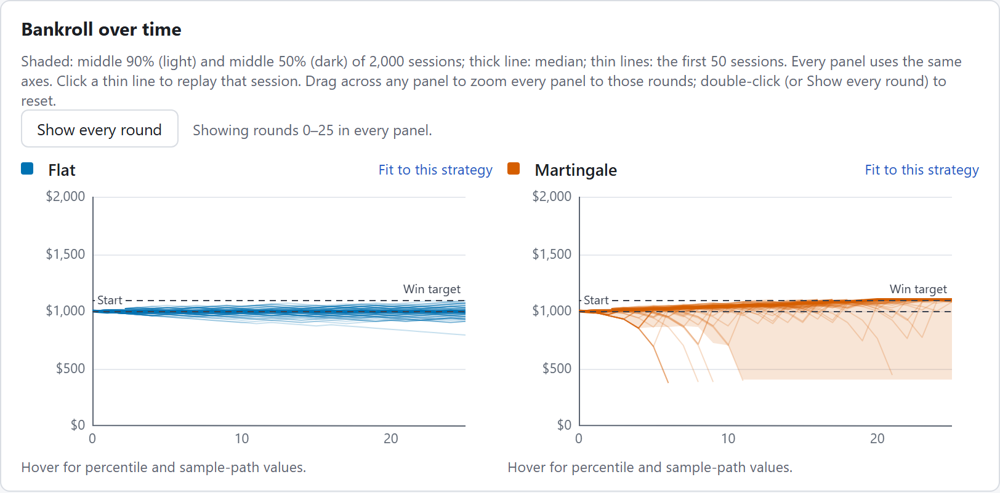
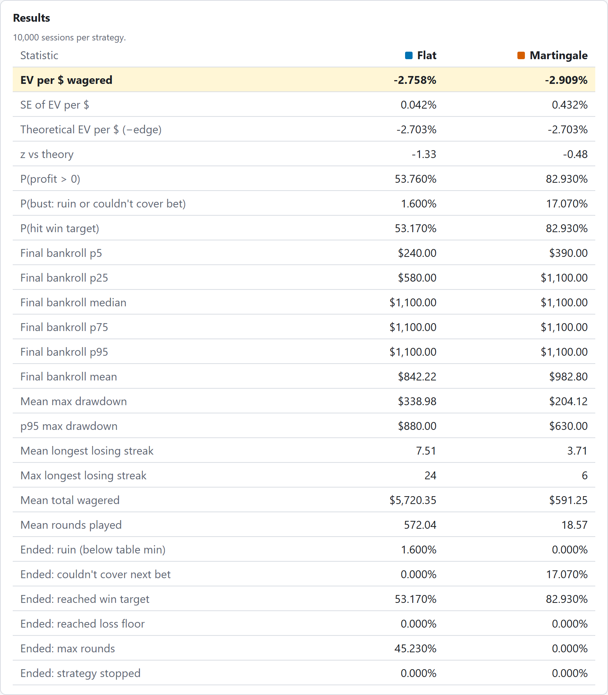
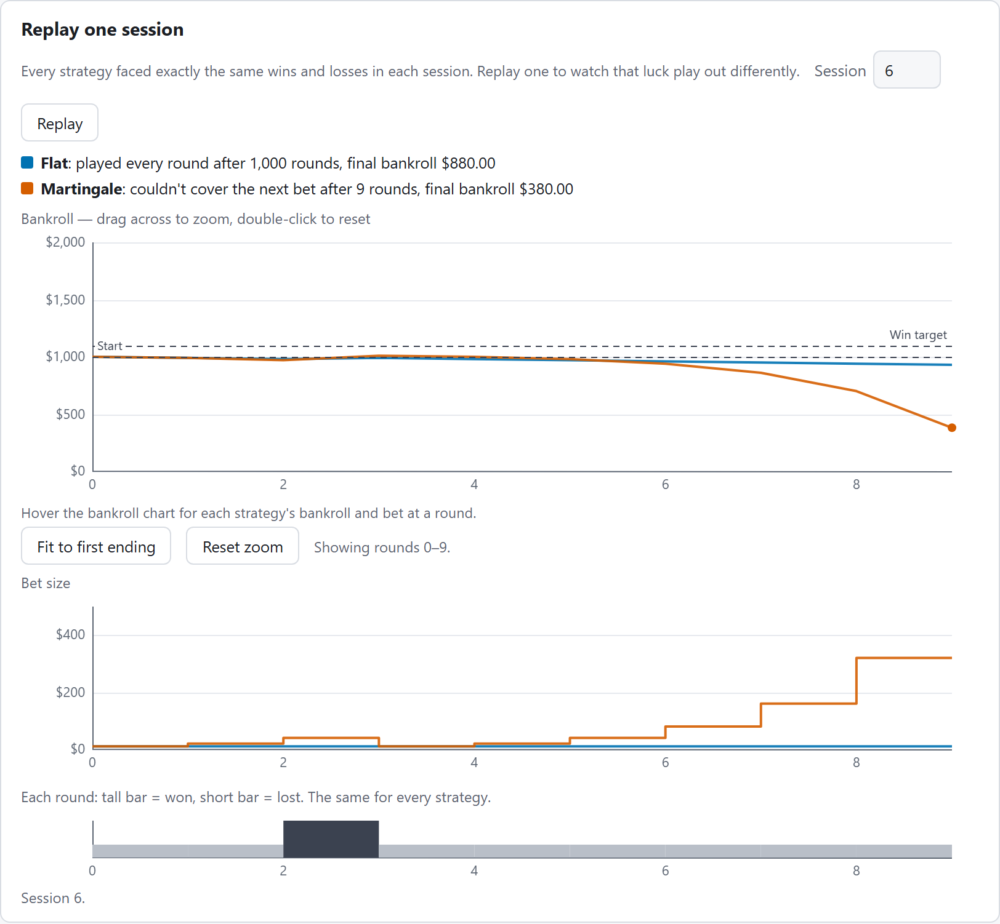

# StrategyLab

A Monte Carlo simulator for betting strategies. **Live at [iangopen.github.io/strategylab](https://iangopen.github.io/strategylab/).**

[](https://github.com/iangopen/strategylab/actions/workflows/ci.yml)

StrategyLab is an educational simulation for adults (18+). No real money is involved, and nothing here is betting advice. If gambling is causing problems for you or someone you know, call or text 1-800-MY-RESET, the US National Problem Gambling Helpline ([ncpgambling.org](https://www.ncpgambling.org/help-treatment/)).

## What it is

In a game with a house edge, every bet loses edge × stake on average, whatever came before it. So a strategy's expected loss is the edge times the total it wagers: Martingale or Fibonacci loses the same expected share of each dollar as a flat bettor. Strategies differ in how their results spread out. StrategyLab lets you check this on your own scenarios.

- **8 built-in strategies:** Flat, Martingale, Paroli, D'Alembert, Fibonacci, Labouchère, Oscar's Grind and Kelly. Up to 8 strategies run side by side, and you can write your own as a rule.
- **Scale:** one run simulates up to 1,000,000 sessions of up to 1,000,000 rounds each. Every strategy plays the same random outcomes in each session.
- **Games:** European and American roulette, a fair coin, any win/lose game, sports odds (American or decimal, two-way market, vig removed proportionally), or a game with up to 12 outcomes and their own payouts.
- **Results:** EV per $ wagered next to its theoretical value and standard error, P(profit), P(bust), final-bankroll percentiles, drawdowns and losing streaks.
- **Charts and replay:** percentile bands over time, final-bankroll histograms, and a replay of any one session for every strategy. Every panel of a chart shares the same axes.
- **Links:** Copy link puts the whole scenario, custom rules included, in the URL.

The default run is European roulette (house edge 1/37 = 2.703%), a $1,000 bankroll, a $10 base bet, a stop at $1,100 and 10,000 sessions with seed 12345. Martingale ends in profit in 82.930% of sessions and Flat in 53.760%. Their EV per $ wagered is −2.909% and −2.758%, against a theoretical −2.703%. Martingale's many small wins are paid for by rare large losses: it busts in 17.070% of sessions, Flat in 1.600%.



*Bankroll over time for the default run, after "Fit to this strategy" on Martingale (rounds 0 to 25). Shaded bands are the middle 90% and 50% of sessions, thin lines are the first 50 sessions.*





## How it works

**Common random numbers.** Session *i* gets the same seed for every strategy, `splitmix32(masterSeed ^ splitmix32(i))`, which seeds a mulberry32 generator. Each round uses exactly one uniform draw, and strategies never touch the generator. So in session *i* every strategy sees the same wins and losses, and a difference in results comes from the strategy, not from luck. See [`src/engine/rng.ts`](src/engine/rng.ts) and [`src/engine/runner.ts`](src/engine/runner.ts).

**Whole cents.** Money is integer cents. A win on a non-integer payout, such as −110 odds, pays the rounded amount and carries the remainder to the next win, so a session's total stays within half a cent of the exact amount.

**A Web Worker for all simulation.** Runs execute in a worker through [Comlink](https://github.com/GoogleChromeLabs/comlink), with progress about every 2% and a Cancel button. The page stays responsive during a run. Per-session data stays in the worker. Only summaries come back: the stats, a shared histogram, 50 sample paths and percentile bands from the first 2,000 sessions.

**A rule language instead of code.** A custom strategy is JSON data, checked against a closed grammar and compiled into the same strategy interface as the built-ins. A progression rule has up to 10 entries for wins and 10 for losses. Each entry has an optional condition (win or loss streak, profit this cycle, bankroll against the start, size of the last bet) and one action (set, multiply, add, reset, reset the cycle, stop). A sequence rule is a custom Labouchère line of up to 20 numbers. This rule is Martingale:

```json
{ "kind": "progression", "name": "Double after a loss", "startUnits": 1,
  "onWin":  [ { "then": { "type": "reset" } } ],
  "onLoss": [ { "then": { "type": "multiply", "by": 2 } } ] }
```

The rule and link code contain no `eval`, `new Function` or dynamic `import`, and a test scans for them. A shared link is untrusted input: over 8,000 characters or nested deeper than 16 levels, it is refused before anything is decoded.

## Testing

- **Unit and statistical tests:** `npm run test` runs 719 Vitest tests, fast unit tests first, then the Monte Carlo tests (`*.stats.test.ts`). Five more (benchmarks and fixture writers) are opt-in.
- **Tolerances come from the data.** A statistical test passes when the measured value is within 4 standard errors of the expected one, with the standard error computed from the simulated sessions. Seeds are fixed, so each run gives the same numbers.
- **The EV invariant:** for every strategy, EV per $ wagered must equal −edge. [`invariant.stats.test.ts`](src/engine/invariant.stats.test.ts) checks 9 strategies (the 8 built-ins and a custom rule) on 8 games with 20,000 sessions each: house-edge, fair and player-edge games, sports odds and multi-outcome games. The largest deviation is 2.78 standard errors. Kelly refuses to bet on the two house-edge multi-outcome games, and the test asserts that instead.
- **A bug the tolerance caught:** before the sub-cent carry, a flat $5 bettor at −110 odds measured 5.29 standard errors from theory over 100,000 sessions. With the carry it measures 0.55 ([`runner.regression.stats.test.ts`](src/engine/runner.regression.stats.test.ts)).
- **Golden files:** stored session and Monte Carlo results must reproduce bit for bit after engine changes.
- **End-to-end:** 44 Playwright tests in 10 spec files run against the production build, served under the same `/strategylab/` path as the live site. Every number the page shows is compared with the engine run in Node on the same scenario. One test runs the app by keyboard only and checks what a screen reader announces.
- **CI:** GitHub Actions runs lint, the Vitest suites, a strict build and the Playwright tests. Only a `main` commit that passes all four deploys to GitHub Pages.

## Get started

Requires Node.js 24. The commands work the same in PowerShell and bash.

```sh
npm ci
npm run dev                       # dev server at http://localhost:5173/
npm run test                      # unit tests, then statistical tests
npm run lint
npm run build                     # strict type check and production build
npx playwright install chromium   # once per machine
npm run e2e                       # Playwright against the production build under /strategylab/
```

`npm run screenshots` regenerates the README images and `public/og-image.png` from the live site, or from `SCREENSHOT_URL` if set. It first checks that the results table equals the engine's numbers.

## Repository map

```
src/engine/    simulation engine, no React or DOM: RNG, games, runner, Monte Carlo,
               strategies/, rules/ (the rule language), stats/
src/worker/    the Web Worker and its client
src/share/     scenario links: encode, decode, validate
src/ui/        React components; ui/charts/ draws with Canvas 2D
e2e/           Playwright specs
scripts/       the licence-notice build plugin and the screenshot script
docs/          spec.md (design and specs), history.md (verification log), README images
```

## Roadmap

Not scheduled. From [`docs/spec.md`](docs/spec.md):

- Three-way sports lines, where the market prices a draw or a push.
- Parlays, whose legs must all win.
- Other ways to remove the vig: power, Shin and additive.

## Privacy

The app runs entirely in your browser. It sends no data anywhere, sets no cookies, and stores one setting, your theme choice, in localStorage.

## Credits

The built site includes these third-party packages. Their full licence texts ship with it as [third-party-licenses.txt](https://iangopen.github.io/strategylab/third-party-licenses.txt), generated at build time by [`scripts/licenseNotices.ts`](scripts/licenseNotices.ts).

| Used | Source | Author | Licence |
|---|---|---|---|
| React, react-dom, scheduler | [react.dev](https://react.dev/) | Meta Platforms, Inc. and affiliates | MIT |
| Comlink | [GoogleChromeLabs/comlink](https://github.com/GoogleChromeLabs/comlink) | Google LLC | Apache-2.0 |
| mulberry32 generator, reimplemented in `src/engine/rng.ts` | [the author's gist](https://gist.github.com/tommyettinger/46a874533244883189143505d203312c) | Tommy Ettinger | CC0 1.0 |
| Strategy colours: the Okabe-Ito colourblind-safe palette | Color Universal Design | Masataka Okabe and Kei Ito | colour values, no licence needed |

Build and test tools (Vite, Vitest, Playwright, TypeScript, oxlint) are not shipped. The favicon and screenshots were made for this project.

## License

[MIT](LICENSE) © 2026 Ian Gopen
